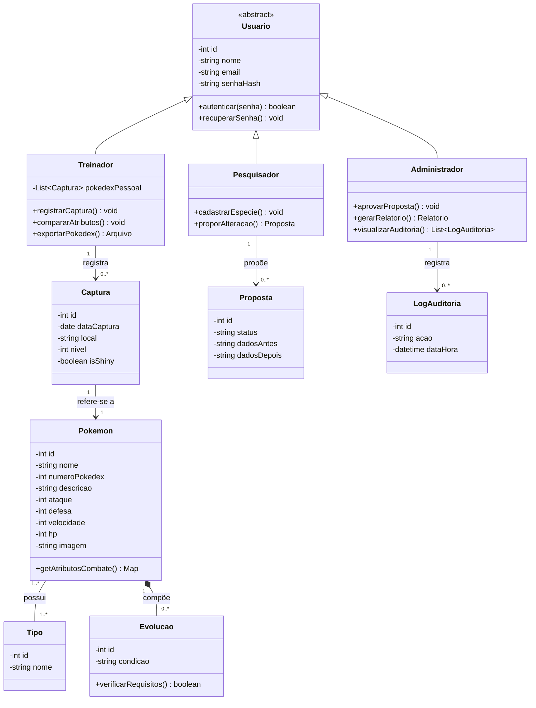

# Diagrama de Classes — Sistema Pokédex Digital

## 1. Código-fonte Mermaid (classDiagram)

Cole este bloco em qualquer ferramenta que aceite sintaxe Mermaid (mermaid.live, plugins de VSCode, Notion, etc.):

---

## 2. Guia estruturado para montagem manual no draw.io

Notação: retângulo UML de 3 compartimentos (nome / atributos / métodos). `-` = privado, `+` = público, `#` = protegido (não usado aqui).

### Classe abstrata: Usuario
*(itálico ou rótulo «abstract» no nome, conforme padrão UML)*

| Compartimento | Conteúdo |
|---|---|
| Atributos | `- id: int`, `- nome: string`, `- email: string`, `- senhaHash: string` |
| Métodos | `+ autenticar(senha: string): boolean`, `+ recuperarSenha(): void` |

### Treinador *(herda de Usuario)*
| Compartimento | Conteúdo |
|---|---|
| Atributos | `- pokedexPessoal: List<Captura>` |
| Métodos | `+ registrarCaptura(): void`, `+ compararAtributos(): void`, `+ exportarPokedex(): Arquivo` |

### Pesquisador *(herda de Usuario)*
| Compartimento | Conteúdo |
|---|---|
| Atributos | *(nenhum além dos herdados)* |
| Métodos | `+ cadastrarEspecie(): void`, `+ proporAlteracao(): Proposta` |

### Administrador *(herda de Usuario)*
| Compartimento | Conteúdo |
|---|---|
| Atributos | *(nenhum além dos herdados)* |
| Métodos | `+ aprovarProposta(): void`, `+ gerarRelatorio(): Relatorio`, `+ visualizarAuditoria(): List<LogAuditoria>` |

### Pokemon
| Compartimento | Conteúdo |
|---|---|
| Atributos | `- id: int`, `- nome: string`, `- numeroPokedex: int`, `- descricao: string`, `- ataque: int`, `- defesa: int`, `- velocidade: int`, `- hp: int`, `- imagem: string` |
| Métodos | `+ getAtributosCombate(): Map` |

### Tipo
| Compartimento | Conteúdo |
|---|---|
| Atributos | `- id: int`, `- nome: string` |
| Métodos | *(nenhum)* |

### Evolucao
| Compartimento | Conteúdo |
|---|---|
| Atributos | `- id: int`, `- condicao: string` |
| Métodos | `+ verificarRequisitos(): boolean` |

### Captura
| Compartimento | Conteúdo |
|---|---|
| Atributos | `- id: int`, `- dataCaptura: date`, `- local: string`, `- nivel: int`, `- isShiny: boolean` |
| Métodos | *(nenhum)* |

### Proposta
| Compartimento | Conteúdo |
|---|---|
| Atributos | `- id: int`, `- status: string`, `- dadosAntes: string`, `- dadosDepois: string` |
| Métodos | *(nenhum)* |

### LogAuditoria
| Compartimento | Conteúdo |
|---|---|
| Atributos | `- id: int`, `- acao: string`, `- dataHora: datetime` |
| Métodos | *(nenhum)* |

---

### Relacionamentos a desenhar

| Origem | Símbolo | Destino | Multiplicidade | Rótulo sugerido |
|---|---|---|---|---|
| Usuario | ◁— (triângulo vazado) | Treinador, Pesquisador, Administrador | — | Herança |
| Treinador | —— | Captura | 1 —— 0..* | registra |
| Captura | —— | Pokemon | 1 —— 1 | refere-se a |
| Pokemon | —— | Tipo | 1..* —— 1..* | possui |
| Pokemon | ◆—— (losango preenchido do lado de Pokemon) | Evolucao | 1 —— 0..* | compõe |
| Pesquisador | —— | Proposta | 1 —— 0..* | propõe |
| Administrador | —— | LogAuditoria | 1 —— 0..* | registra |

**Dica de layout no draw.io**: posicione `Usuario` no topo central, as três subclasses logo abaixo lado a lado (herança descendo). `Pokemon` fica ao centro do restante do diagrama, com `Captura`, `Tipo` e `Evolucao` ao redor dele. `Proposta` e `LogAuditoria` ficam próximos de `Pesquisador` e `Administrador`, respectivamente, já que só se conectam a essas classes.
